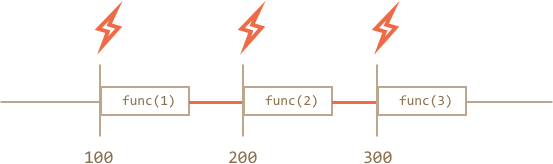

# Scheduling: setTimeout and setInterval
# Scheduling: setTimeout 과 setInterval

We may decide to execute a function not right now, but at a certain time later. That's called "scheduling a call".
아마도 함수를 지금 당장 실행하는것이 아니라 나중에 실행해야 될때가 있습니다. 이것을 "호출 예약하기scheduling a call"라고 합니다.

There are two methods for it:
이것을 구현하기 위한 두가지 방법이 있습니다.

- `setTimeout` allows to run a function once after the interval of time.
- `setTimeout` 일정시간이 지난후에 함수를 실행합니다.
- `setInterval` allows to run a function regularly with the interval between the runs.
- `setInterval` 실행되고 일정시간동안 함수를 계속 실행합니다.

These methods are not a part of JavaScript specification. But most environments have the internal scheduler and provide these methods. In particular, they are supported in all browsers and Node.JS.
이러한 방법들은 자바스크립트의 규격은 아닙니다만 거의 모든 환경들이 내부 scheduler와 그것을 지원하는 매서드들을 가지고 있습니다. 특별히, 대부분의 브라우저와 Node.JS에서 지원이 됩니다.

## setTimeout

The syntax:
문법

```js
let timerId = setTimeout(func|code, [delay], [arg1], [arg2], ...)
```

Parameters:
매개변수

`func|code`
: Function or a string of code to execute.
함수 또는 코드 문자열이 실행됩니다.
Usually, that's a function. For historical reasons, a string of code can be passed, but that's not recommended.
보통은 이건 함수 입니다. 역사적인 이유로 코드의 문자열로 넘겨질 수 도 있지만 추천되는 방법은 아닙니다. 

`delay`
: The delay before run, in milliseconds (1000 ms = 1 second), by default 0.
실행하기전에 밀리세컨 단위로 딜레이를 줍니다. 기본값은 0 입니다.

`arg1`, `arg2`...
: Arguments for the function (not supported in IE9-)
함수의 변수들(IE9 에서는 지원되지 않음).

For instance, this code calls `sayHi()` after one second:
예를 들면, 다음 코드는 1초후에 `sayHi()` 를 호출합니다.

```js run
function sayHi() {
  alert('Hello');
}

*!*
setTimeout(sayHi, 1000);
*/!*
```

With arguments:
매개변수와 사용

```js run
function sayHi(phrase, who) {
  alert( phrase + ', ' + who );
}

*!*
setTimeout(sayHi, 1000, "Hello", "John"); // Hello, John
*/!*
```

If the first argument is a string, then JavaScript creates a function from it.
만약에 첫번째 매개변수가 문자이면 자바스크립트는 그것으로 부터 함수를 생성합니다.

So, this will also work:
그래서 다음과 같이 해도 작동하게 됩니다.

```js run no-beautify
setTimeout("alert('Hello')", 1000);
```

But using strings is not recommended, use functions instead of them, like this:
그러나 문자열들을 사용하는건 추천하지 않습니다. 다음과 같이 함수를 사용하는것이 더 좋습니다.

```js run no-beautify
setTimeout(() => alert('Hello'), 1000);
```

````smart header="Pass a function, but don't run it"
Novice developers sometimes make a mistake by adding brackets `()` after the function:

```js
// wrong!
setTimeout(sayHi(), 1000);
```
That doesn't work, because `setTimeout` expects a reference to function. And here `sayHi()` runs the function, and the *result of its execution* is passed to `setTimeout`. In our case the result of `sayHi()` is `undefined` (the function returns nothing), so nothing is scheduled.
````

### Canceling with clearTimeout

A call to `setTimeout` returns a "timer identifier" `timerId` that we can use to cancel the execution.
`setTimeout` 을 실행하면 "timer identifier" 를 반환합니다. 실행단계에서 `timeId`를 사용해서 취소할 수 있습니다.
The syntax to cancel:
취소하기 위한 문법

```js
let timerId = setTimeout(...);
clearTimeout(timerId);
```

In the code below, we schedule the function and then cancel it (changed our mind). As a result, nothing happens:
아래의 코드처럼 함수를 스케쥴하고 취소할 수 있습니다(마음이 바뀌었을때). 결과적으로 아무일도 일어나지 않습니다.

```js run no-beautify
let timerId = setTimeout(() => alert("never happens"), 1000);
alert(timerId); // timer identifier

clearTimeout(timerId);
alert(timerId); // same identifier (doesn't become null after canceling)
```

As we can see from `alert` output, in a browser the timer identifier is a number. In other environments, this can be something else. For instance, Node.JS returns a timer object with additional methods.
`alert`결과로 the timer identifier는 숫자라는 것을 알 수 있습니다. 다른환경에서는 조금 다를 수 있습니다. 예를 들면, Node.JS는 하나의 타이머 오브젝트를 추가적인 메서드들과 반환합니다.

Again, there is no universal specification for these methods, so that's fine.
그러나 다시한번 얘기하자면 이러한 메서드들을 위한 다목적인 규격은 없습니다.

For browsers, timers are described in the [timers section](https://www.w3.org/TR/html5/webappapis.html#timers) of HTML5 standard.
브라우저의 경우 타이머들은 [timers section](https://www.w3.org/TR/html5/webappapis.html#timers) 에서 HTML5 기본으로 기술되어 있습니다.

## setInterval

The `setInterval` method has the same syntax as `setTimeout`:
`setInterval` 메서드는 `setTimeout`과 똑같은 문법을 가지고 있습니다.

```js
let timerId = setInterval(func|code, [delay], [arg1], [arg2], ...)
```

All arguments have the same meaning. But unlike `setTimeout` it runs the function not only once, but regularly after the given interval of time.
모든 변수들은 똑같은 의미를 가지고 있습니다. 그라나 `setTimeout`은 함수를 단 한번만 실행하지는 않습니다. 대신에 주어진 일정시간동안 주기적으로 실행합니다.

To stop further calls, we should call `clearInterval(timerId)`.
호출된것을 멈추려면 `clearInterval(timerId)`를 호출해야 합니다.

The following example will show the message every 2 seconds. After 5 seconds, the output is stopped:
다음예는 메세지를 2초마다 보여줍니다. 5초후에는 정지됩니다.

```js run
// repeat with the interval of 2 seconds
let timerId = setInterval(() => alert('tick'), 2000);

// after 5 seconds stop
setTimeout(() => { clearInterval(timerId); alert('stop'); }, 5000);
```

```smart header="Modal windows freeze time in Chrome/Opera/Safari"
In browsers IE and Firefox the internal timer continues "ticking" while showing `alert/confirm/prompt`, but in Chrome, Opera and Safari the internal timer becomes "frozen".

So if you run the code above and don't dismiss the `alert` window for some time, then in Firefox/IE next `alert` will be shown immediately as you do it (2 seconds passed from the previous invocation), and in Chrome/Opera/Safari -- after 2 more seconds (timer did not tick during the `alert`).
```

## Recursive setTimeout

There are two ways of running something regularly.
주기적으로 실행하게 하는 방법에는 크게 2가지가 있습니다.

One is `setInterval`. The other one is a recursive `setTimeout`, like this:
하나는 `setInterval`이고 다른하나는 `setTimeout`를 순회하는것 입니다.
다음과 같습니다.

```js
/** instead of:
let timerId = setInterval(() => alert('tick'), 2000);
*/

let timerId = setTimeout(function tick() {
  alert('tick');
*!*
  timerId = setTimeout(tick, 2000); // (*)
*/!*
}, 2000);
```

The `setTimeout` above schedules the next call right at the end of the current one `(*)`.
위에 있는 `setTimeout` 스케쥴러는 현재 마지막에 있는 `(*)` 후에 다음 호출을 실행합니다.

The recursive `setTimeout` is a more flexible method than `setInterval`. This way the next call may be scheduled differently, depending on the results of the current one.
회귀적인 `setTimeout` 방법은 `setInterval`보다 유동적입니다. 이 방법은 다음 호출이 다르게 스케쥴되었을때 사용됩니다. 현재결과에 달려있는것이죠.

For instance, we need to write a service that sends a request to the server every 5 seconds asking for data, but in case the server is overloaded, it should increase the interval to 10, 20, 40 seconds...
예를들면, 매 5초마다 데이터 값을 얻기위해 서버에 request를 보내는 서비스를 작성해야 한다고 할때, 이때 서버는 오버로드 될 수 있고 이때는 시차를 10, 20, 40 초로 증가시켜야 할것입니다...

Here's the pseudocode:
여기에 의사코드가 있습니

```js
let delay = 5000;

let timerId = setTimeout(function request() {
  ...send request...

  if (request failed due to server overload) {
    // increase the interval to the next run
    delay *= 2;
  }

  timerId = setTimeout(request, delay);

}, delay);
```


And if we regularly have CPU-hungry tasks, then we can measure the time taken by the execution and plan the next call sooner or later.
만약 CPU를 많이 소모하는 작업이라면, 실행단계에서 소모되는 시간을 측정할 수 있고 그것에 따라 호출을 먼저할지 나중에 할지 계획을 세울수 있을것입니다.

**Recursive `setTimeout` guarantees a delay between the executions, `setInterval` -- does not.**
**회귀적인 `setTimeout`은 다음 실행과의 사이에서 딜레이를 보장합니다. `setInterval`은 아닙니다.**

Let's compare two code fragments. The first one uses `setInterval`:
두 코드의 요소들을 비교해 보겠습니다. 첫번째는 `setinterval`입니다.

```js
let i = 1;
setInterval(function() {
  func(i);
}, 100);
```

The second one uses recursive `setTimeout`:
두번째는 회귀적인 `setTimeout`입니다.

```js
let i = 1;
setTimeout(function run() {
  func(i);
  setTimeout(run, 100);
}, 100);
```

For `setInterval` the internal scheduler will run `func(i)` every 100ms:
`setInterval` 은 내부적인 스케쥴러가 `func(i)`를 100ms 마다 실행합니다.



Did you notice?
알아차리셨나요?

**The real delay between `func` calls for `setInterval` is less than in the code!**
**`setInterval`을 위한 `func`를 호출할때 실제 딜레이는 코드에 있는것보다 짧습니다!**

That's normal, because the time taken by `func`'s execution "consumes" a part of the interval.
이건 정상입니다. 왜냐하면 `func`가 소모하는 시간은 내부적인 부분에서 실행단계가 "소모되는" 부분이기 때문입니다.

It is possible that `func`'s execution turns out to be longer than we expected and takes more than 100ms.
`func`의 실행이 예상하는것보다 그리고 100ms 보다 더 길어질 수도 있습니다.

In this case the engine waits for `func` to complete, then checks the scheduler and if the time is up, runs it again *immediately*.
이런경우에는 엔진이 `func`이 끝날때 까지 기다리고 스케쥴러를 확인한후에 시간이 다되었으면 *바로* 다시 실행합니다.

In the edge case, if the function always executes longer than `delay` ms, then the calls will happen without a pause at all.
이런 경우, 함수는 항상 `delay`ms 보다 늦게 실행 됩니다, 그리고는 호출들이 모든것을 멈추지않고 계속될 것입니다.

And here is the picture for the recursive `setTimeout`:
여기 회귀적인 `setTimeout`그림이 있습니다.


**The recursive `setTimeout` guarantees the fixed delay (here 100ms).**
**회귀적인 `setTimeout`은 지정된 딜레이(여기서는 100ms)를 보장합니다**

That's because a new call is planned at the end of the previous one.
왜냐하면 새로운 호출이 계획될때는 이전것이 끝나는 곳이기 때문입니다.

````smart header="Garbage collection"
When a function is passed in `setInterval/setTimeout`, an internal reference is created to it and saved in the scheduler. It prevents the function from being garbage collected, even if there are no other references to it.

```js
// the function stays in memory until the scheduler calls it
setTimeout(function() {...}, 100);
```

For `setInterval` the function stays in memory until `clearInterval` is called.

There's a side-effect. A function references the outer lexical environment, so, while it lives, outer variables live too. They may take much more memory than the function itself. So when we don't need the scheduled function anymore, it's better to cancel it, even if it's very small.
````

## setTimeout(...,0)

There's a special use case: `setTimeout(func, 0)`, or just `setTimeout(func)`.

This schedules the execution of `func` as soon as possible. But scheduler will invoke it only after the current code is complete.

So the function is scheduled to run "right after" the current code. In other words, *asynchronously*.

For instance, this outputs "Hello", then immediately "World":

```js run
setTimeout(() => alert("World"));

alert("Hello");
```

The first line "puts the call into calendar after 0ms". But the scheduler will only "check the calendar" after the current code is complete, so `"Hello"` is first, and `"World"` -- after it.

### Splitting CPU-hungry tasks

There's a trick to split CPU-hungry tasks using `setTimeout`.

For instance, a syntax-highlighting script (used to colorize code examples on this page) is quite CPU-heavy. To highlight the code, it performs the analysis, creates many colored elements, adds them to the document -- for a big text that takes a lot. It may even cause the browser to "hang", which is unacceptable.

So we can split the long text into pieces. First 100 lines, then plan another 100 lines using `setTimeout(..., 0)`, and so on.

For clarity, let's take a simpler example for consideration. We have a function to count from `1` to `1000000000`.

If you run it, the CPU will hang. For server-side JS that's clearly noticeable, and if you are running it in-browser, then try to click other buttons on the page -- you'll see that whole JavaScript actually is paused, no other actions work until it finishes.

```js run
let i = 0;

let start = Date.now();

function count() {

  // do a heavy job
  for (let j = 0; j < 1e9; j++) {
    i++;
  }

  alert("Done in " + (Date.now() - start) + 'ms');
}

count();
```

The browser may even show "the script takes too long" warning (but hopefully it won't, because the number is not very big).

Let's split the job using the nested `setTimeout`:

```js run
let i = 0;

let start = Date.now();

function count() {

  // do a piece of the heavy job (*)
  do {
    i++;
  } while (i % 1e6 != 0);

  if (i == 1e9) {
    alert("Done in " + (Date.now() - start) + 'ms');
  } else {
    setTimeout(count); // schedule the new call (**)
  }

}

count();
```

Now the browser UI is fully functional during the "counting" process.

We do a part of the job `(*)`:

1. First run: `i=1...1000000`.
2. Second run: `i=1000001..2000000`.
3. ...and so on, the `while` checks if `i` is evenly divided by `1000000`.

Then the next call is scheduled in `(**)` if we're not done yet.

Pauses between `count` executions provide just enough "breath" for the JavaScript engine to do something else, to react to other user actions.

The notable thing is that both variants -- with and without splitting the job by `setTimeout` -- are comparable in speed. There's no much difference in the overall counting time.

To make them closer, let's make an improvement.

We'll move the scheduling in the beginning of the `count()`:

```js run
let i = 0;

let start = Date.now();

function count() {

  // move the scheduling at the beginning
  if (i < 1e9 - 1e6) {
    setTimeout(count); // schedule the new call
  }

  do {
    i++;
  } while (i % 1e6 != 0);

  if (i == 1e9) {
    alert("Done in " + (Date.now() - start) + 'ms');
  }

}

count();
```

Now when we start to `count()` and know that we'll need to `count()` more, we schedule that immediately, before doing the job.

If you run it, it's easy to notice that it takes significantly less time.

````smart header="Minimal delay of nested timers in-browser"
In the browser, there's a limitation of how often nested timers can run. The [HTML5 standard](https://www.w3.org/TR/html5/webappapis.html#timers) says: "after five nested timers, the interval is forced to be at least four milliseconds.".

Let's demonstrate what it means with the example below. The `setTimeout` call in it re-schedules itself after `0ms`. Each call remembers the real time from the previous one in the `times` array. What do the real delays look like? Let's see:

```js run
let start = Date.now();
let times = [];

setTimeout(function run() {
  times.push(Date.now() - start); // remember delay from the previous call

  if (start + 100 < Date.now()) alert(times); // show the delays after 100ms
  else setTimeout(run); // else re-schedule
});

// an example of the output:
// 1,1,1,1,9,15,20,24,30,35,40,45,50,55,59,64,70,75,80,85,90,95,100
```

First timers run immediately (just as written in the spec), and then the delay comes into play and we see `9, 15, 20, 24...`.

That limitation comes from ancient times and many scripts rely on it, so it exists for historical reasons.

For server-side JavaScript, that limitation does not exist, and there exist other ways to schedule an immediate asynchronous job, like [process.nextTick](https://nodejs.org/api/process.html) and [setImmediate](https://nodejs.org/api/timers.html) for Node.JS. So the notion is browser-specific only.
````

### Allowing the browser to render

Another benefit for in-browser scripts is that they can show a progress bar or something to the user. That's because the browser usually does all "repainting" after the script is complete.

So if we do a single huge function then even if it changes something, the changes are not reflected in the document till it finishes.

Here's the demo:
```html run
<div id="progress"></div>

<script>
  let i = 0;

  function count() {
    for (let j = 0; j < 1e6; j++) {
      i++;
      // put the current i into the <div>
      // (we'll talk more about innerHTML in the specific chapter, should be obvious here)
      progress.innerHTML = i;
    }
  }

  count();
</script>
```

If you run it, the changes to `i` will show up after the whole count finishes.

And if we use `setTimeout` to split it into pieces then changes are applied in-between the runs, so this looks better:

```html run
<div id="progress"></div>

<script>
  let i = 0;

  function count() {

    // do a piece of the heavy job (*)
    do {
      i++;
      progress.innerHTML = i;
    } while (i % 1e3 != 0);

    if (i < 1e9) {
      setTimeout(count);
    }

  }

  count();
</script>
```

Now the `<div>` shows increasing values of `i`.

## Summary

- Methods `setInterval(func, delay, ...args)` and `setTimeout(func, delay, ...args)` allow to run the `func` regularly/once after `delay` milliseconds.
- To cancel the execution, we should call `clearInterval/clearTimeout` with the value returned by `setInterval/setTimeout`.
- Nested `setTimeout` calls is a more flexible alternative to `setInterval`. Also they can guarantee the minimal time *between* the executions.
- Zero-timeout scheduling `setTimeout(...,0)` is used to schedule the call "as soon as possible, but after the current code is complete".

Some use cases of `setTimeout(...,0)`:
- To split CPU-hungry tasks into pieces, so that the script doesn't "hang"
- To let the browser do something else while the process is going on (paint the progress bar).

Please note that all scheduling methods do not *guarantee* the exact delay. We should not rely on that in the scheduled code.

For example, the in-browser timer may slow down for a lot of reasons:
- The CPU is overloaded.
- The browser tab is in the background mode.
- The laptop is on battery.

All that may increase the minimal timer resolution (the minimal delay) to 300ms or even 1000ms depending on the browser and settings.
